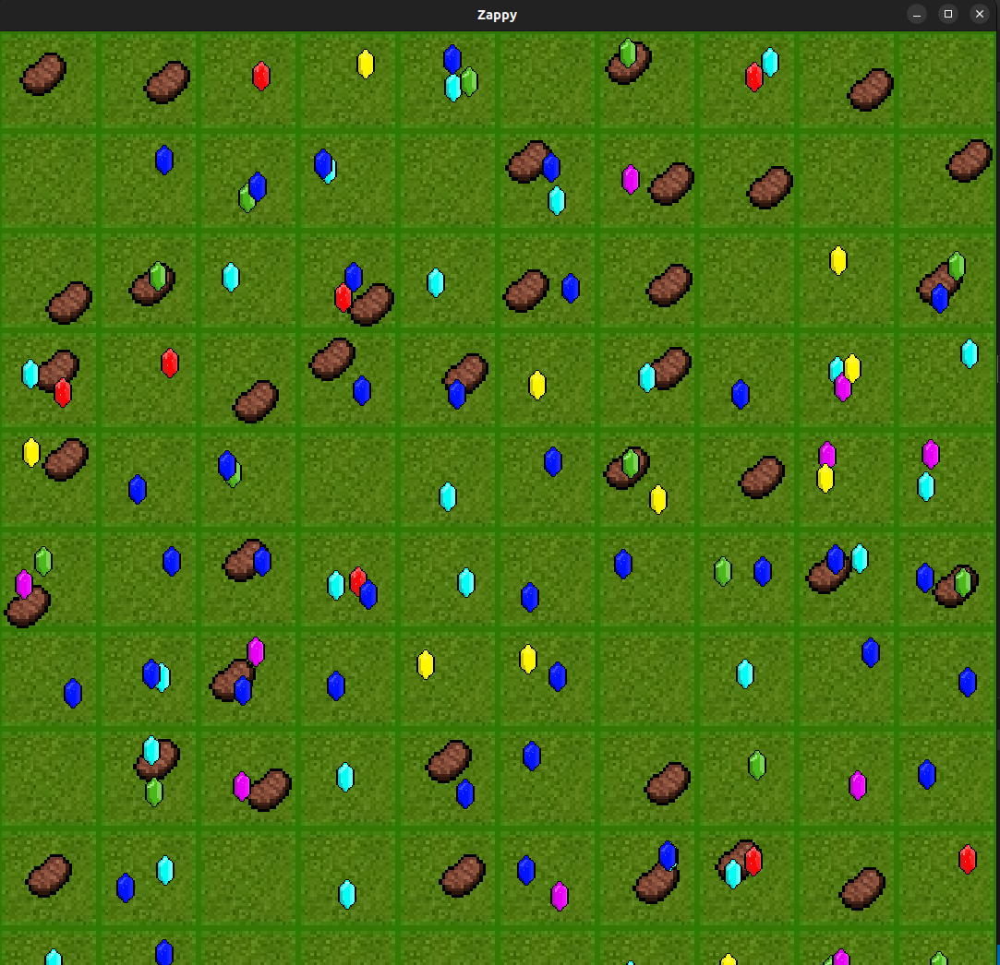
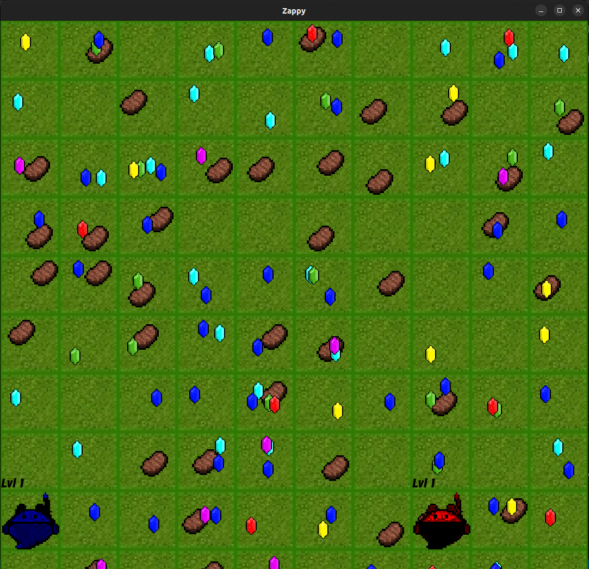
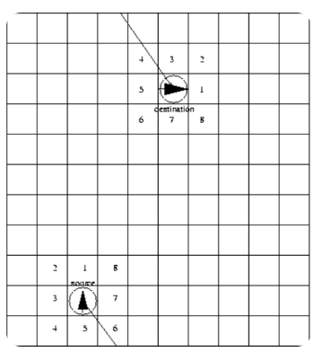
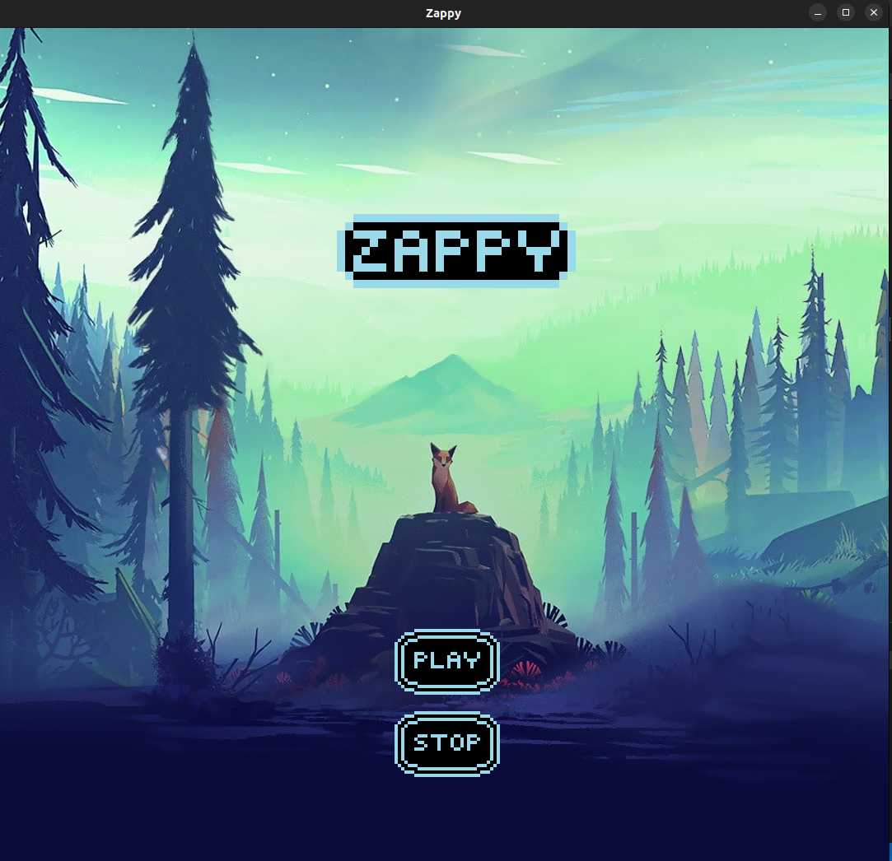

# Zappy

## Introduction
Zappy is a tribute to Zaphod Beeblebrox. It is a network game where several teams confront each other on a tile map containing resources. The winning team is the first one where at least 6 players reach the maximum elevation.

## Binaries
- `zappy_server`: Written in C, generates the inhabitants' world.
- `zappy_gui`: Written in C++, visualizes the world.
- `zappy_ai`: No language constraint, drives an inhabitant through orders sent to the server.

## Usage

### Server
```sh
./zappy_server -p port -x width -y height -n name1 name2 ... -c clientsNb -f freq
```
- `-p`: port number
- `-x`: width of the world
- `-y`: height of the world
- `-n`: name of the team
- `-c`: number of authorized clients per team
- `-f`: reciprocal of time unit for execution of actions

### GUI
```sh
./zappy_gui -p port -h machine
```
- `-p`: port number
- `-h`: hostname of the server

### AI
```sh
./zappy_ai -p port -n name -h machine
```
- `-p`: port number
- `-n`: name of the team
- `-h`: name of the machine; localhost by default

## Game Environment

### Geography
- The game world, Trantor, has zero-relief planes (no craters, valleys, or mountains).
- The game board represents the entirety of this world’s surface, like a world map.
- Exiting the board on one side brings the player back through the opposite side.

### Resources
- The environment is rich in resources (both mineral and dietary).
- Resources are spread evenly across the map.
- Resource types include: linemate, deraumere, sibur, mendiane, phiras, thystame.



### Elevation Ritual
- Players must gather a certain number of each stone and players with the same level on the same terrain unit.
- Elevation begins when a player initiates the incantation.



### Vision
- Players’ field of vision increases with each elevation level.



## Protocol
### Server to Client Communication
- `msz X Y\n`: map size
- `bct X Y q0 q1 q2 q3 q4 q5 q6\n`: content of a tile
- `tna N\n`: name of all the teams
- `pnw #n X Y O L N\n`: connection of a new player
- `ppo #n X Y O\n`: player’s position
- `plv #n L\n`: player’s level
- `pin #n X Y q0 q1 q2 q3 q4 q5 q6\n`: player’s inventory
- `pex #n\n`: expulsion
- `pbc #n M\n`: broadcast
- `pic X Y L #n #n ... \n`: start of an incantation
- `pie X Y R\n`: end of an incantation
- `pfk #n\n`: egg laying by the player
- `pdr #n i\n`: resource dropping
- `pgt #n i\n`: resource collecting
- `pdi #n\n`: death of a player
- `enw #e #n X Y\n`: an egg was laid by a player
- `ebo #e\n`: player connection for an egg
- `edi #e\n`: death of an egg
- `sgt T\n`: time unit request
- `sst T\n`: time unit modification
- `seg N\n`: end of game
- `smg M\n`: message from the server
- `suc\n`: unknown command
- `sbp\n`: command parameter

## Development
### Makefile
The Makefile should contain rules to compile `zappy_server`, `zappy_gui`, and `zappy_ai`.

### Commands
- `Forward`: move up one tile
- `Right`: turn 90° right
- `Left`: turn 90° left
- `Look`: look around
- `Inventory`: check inventory
- `Broadcast text`: broadcast a message
- `Connect_nbr`: number of team unused slots
- `Fork`: fork a player
- `Eject`: eject players from this tile
- `Take object`: take an object
- `Set object`: set an object down
- `Incantation`: start incantation

### GUI Development
- The graphical client should be developed using C++.
- The interface must support at least a 2D visualization of the world.


